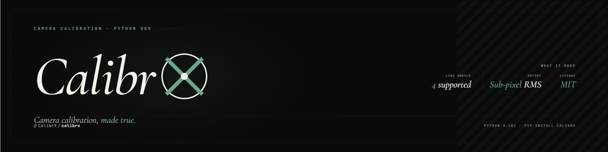

<p align="center">
  
</p>

<div align="center">

[](#install)
[](#features)
[](#features)
[](#features)
[](#cli-usage)
[](#license)

</div>

# CalibrX

The official Python SDK for the [calibrx.io](https://calibrx.io) camera
calibration platform.

Use CalibrX to bring platform-generated calibration results into your local
computer vision workflows. Export a calibration from calibrx.io, load it in
Python, and apply the same camera model, distortion coefficients, and
undistortion settings in scripts, notebooks, production pipelines, or command
line tools.

## Features

- Load CalibrX JSON and YAML calibration exports.
- Support `pinhole`, `pinhole_wide`, and `fisheye` camera models.
- Apply saved undistortion settings such as `balance` and `fov_scale`.
- Override `balance` and `fov_scale` at runtime for local experiments.
- Use either Python arrays, image files, or the CLI.
- Work in scripts, notebooks, CI jobs, and batch processing pipelines.

## Install

```bash
pip install calibrx
```

## Quick Start

```python
from calibrx import undistort_file

undistort_file(
    "input.jpg",
    "rectified_calibration.json",
    "output.jpg",
)
```

The calibration export decides the camera model and default undistortion
settings. You can override them when needed:

```python
from calibrx import undistort_file

undistort_file(
    "input.jpg",
    "rectified_calibration.yaml",
    "output.jpg",
    balance=0.5,
    fov_scale=1.0,
)
```

## Notebook Usage

```python
import cv2
import matplotlib.pyplot as plt
from calibrx import load_calibration, undistort

image = cv2.imread("input.jpg")
calibration = load_calibration("rectified_calibration.json")

result = undistort(image, calibration)

plt.figure(figsize=(14, 6))

plt.subplot(1, 2, 1)
plt.imshow(cv2.cvtColor(image, cv2.COLOR_BGR2RGB))
plt.title("Original")
plt.axis("off")

plt.subplot(1, 2, 2)
plt.imshow(cv2.cvtColor(result.image, cv2.COLOR_BGR2RGB))
plt.title("Undistorted")
plt.axis("off")

plt.show()
```

If Jupyter cannot import `calibrx`, install a kernel from the same environment:

```bash
source .venv/bin/activate
python -m pip install ipykernel
python -m ipykernel install --user --name calibrx --display-name "Python (calibrx)"
```

## Python API

```python
from calibrx import (
    Calibration,
    load_calibration,
    undistort,
    undistort_image,
    undistort_file,
)
```

### Load a Calibration

```python
calibration = load_calibration("calibration.json")

print(calibration.camera_model)
print(calibration.image_size)
print(calibration.K)
print(calibration.D.reshape(-1))
print(calibration.balance)
```

### Undistort an Image Array

```python
import cv2
from calibrx import load_calibration, undistort

image = cv2.imread("input.jpg")
calibration = load_calibration("rectified_calibration.json")

result = undistort(image, calibration)

cv2.imwrite("output.jpg", result.image)
print(result.camera_matrix)
print(result.roi)
```

`result.roi` is the OpenCV valid-pixel ROI for pinhole models. Fisheye
undistortion does not return an ROI, so the value is `None`.

### Return Only the Image

```python
from calibrx import undistort_image

undistorted = undistort_image("input.jpg", "rectified_calibration.json")
```

### Handle Errors

```python
from calibrx import CalibrationFormatError, UndistortionError

try:
    result = undistort("input.jpg", "rectified_calibration.json")
except CalibrationFormatError as exc:
    print(f"Invalid calibration export: {exc}")
except UndistortionError as exc:
    print(f"Could not undistort image: {exc}")
```

## CLI Usage

Single image:

```bash
calibrx undistort input.jpg rectified_calibration.json output.jpg
```

Fisheye tuning:

```bash
calibrx undistort input.jpg rectified_calibration.json output.jpg \
  --balance 0.5 \
  --fov-scale 1.0
```

Batch a directory:

```bash
calibrx undistort ./frames rectified_calibration.json ./undistorted --glob "*.jpg"
```

The CLI prints every output path it writes.

## Supported Exports

The SDK supports calibration exports from calibrx.io:

- `calibration.json`
- `calibration.yaml`
- `rectified_calibration.json`
- `rectified_calibration.yaml`

It expects OpenCV-ready intrinsics:

- `intrinsics.camera_matrix`, or named `fx`, `fy`, `cx`, `cy` parameters.
- `intrinsics.distortion_coefficients`, or named distortion parameters such as
  `k1`, `k2`, `p1`, `p2`, and `k3`.
- `camera_model`: `pinhole`, `pinhole_wide`, or `fisheye`.

See [docs/export-format.md](docs/export-format.md) for the full schema.

## Development

For local development from this repository:

```bash
python -m venv .venv
source .venv/bin/activate
python -m pip install --upgrade pip
python -m pip install -e ".[dev]"
```

Run the test suite:

```bash
python -m pytest
```

Build and validate the package:

```bash
python -m build
python -m twine check dist/*
```

Run a quick local smoke test:

```bash
python - <<'PY'
import numpy as np
from calibrx import Calibration, undistort

print("calibrx import ok")

image = np.zeros((32, 48, 3), dtype=np.uint8)
calibration = Calibration.from_dict({
    "camera_model": "pinhole",
    "image_width": 48,
    "image_height": 32,
    "camera_matrix": [[40, 0, 24], [0, 40, 16], [0, 0, 1]],
    "distortion_coefficients": [0, 0, 0, 0, 0],
})

result = undistort(image, calibration)
print(result.image.shape)
print(result.camera_matrix.shape)
PY
```

## License

MIT. See [LICENSE](LICENSE).
